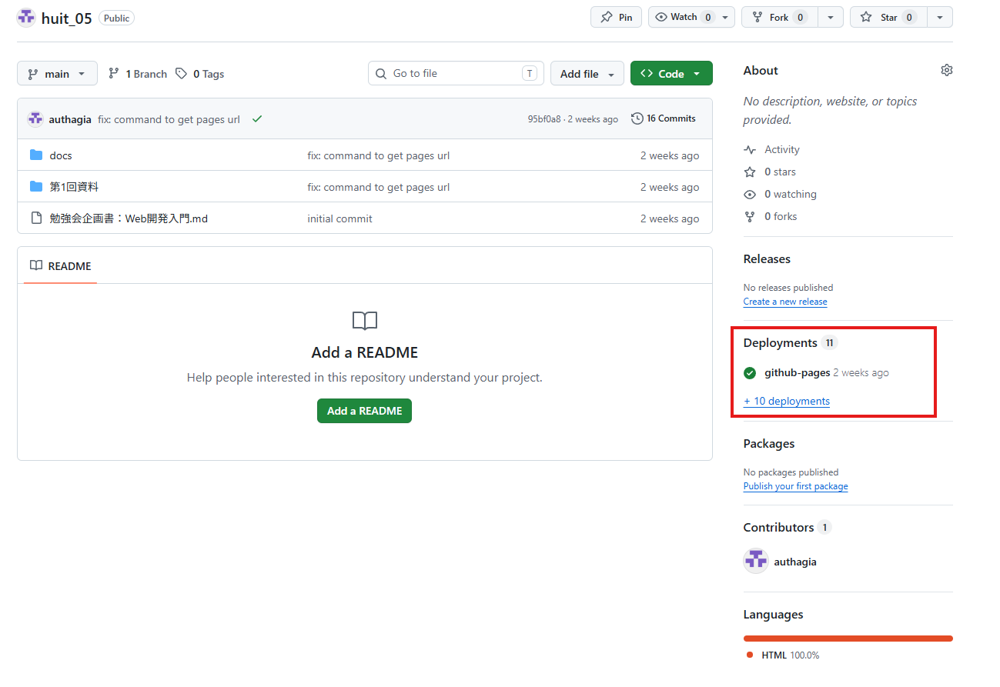
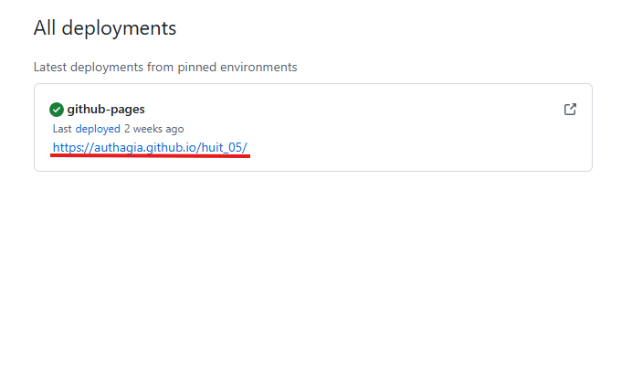

# Web系勉強会 第1回
## 環境構築と世界への公開

<!-- 
対象: プログラミング初学者
時間: 2.5時間（150分）
目標: 全員が「自分のURL」をDiscordに貼り付けられる状態にする
-->

---

## 今日学ぶこと

1. **開発環境の準備** — VS Code、Git、GitHub CLIをインストール
2. **自分のサイトを作る** — 最小構成のHTMLを配置
3. **世界に公開する** — GitHub PagesでURLを取得

<!-- 
話す内容:
- 今日は何もない状態から、自分のウェブサイトを公開するまでをやります
- 「自分の書いたものがURLになる」という体験を最初の日に持っていきます
-->

---

## 1. 開発環境の準備

### 必要な3つのツール

| ツール | 役割 |
|--------|------|
| **VS Code** | コードを書いていくエディタ |
| **Git** | 変更履歴を管理するシステム |
| **GitHub CLI** | GitHubをコマンドで操作する道具 |

<!-- 
話す内容:
- この3つがあれば、ウェブサイトを書いて公開できるようになります
- まずはインストール慌てないで、1つずつ入れていきます
-->

---

## VS Codeのインストール

### Windows

```powershell
winget install Microsoft.VisualStudioCode
```

### Mac

1. https://code.visualstudio.com/ からダウンロード
2. `.zip` を展開 → `Applications` フォルダにドラッグ

<!-- 
話す内容:
- wingetはWindows標準のパッケージマネージャー
- コマンド1つで入ります
- MacはブラウザからダウンロードでもOK
-->

---

## Gitのインストール

### Windows

```powershell
winget install Git.Git
```

### Mac

デフォルトでインストールされているので不要

### 確認

```bash
git --version
```

<!-- 
話す内容:
- Gitはバージョン管理ツール
- コードを書いていく過程で「変更履歴」を残せるようになります
-->

---

## GitHub CLIのインストール

### Windows

```powershell
winget install GitHub.cli
```

### Mac

```bash
brew install gh
```

### 確認

```bash
gh --version
```

<!-- 
話す内容:
- GitHub CLIはGitHubをターミナルから操作できるツール
- 今天的メイン道具になります
-->

---

## GitHub CLIにログイン

##### githubのアカウントを作成後以下を実行

```bash
gh auth login
```

### 選択する項目

```
? What account do you want to log into? → GitHub.com
? What is your preferred protocol for Git operations? → HTTPS
? Authenticate Git with your GitHub credentials? → Yes
? How would you like to authenticate GitHub CLI? → Login with a web browser
```

<!-- 
話す内容:
- ブラウザが開くので「Authorize GitHub CLI」をクリック
- ターミナルにSuccessと出ればOK
-->

---

## 2. 自分のサイトを作る

### 作業フォルダを作成

1. デスクトップなどに新規フォルダを作成（例: `my-page`）
2. VS Codeで「ファイル」→「フォルダを開く」
3. そのフォルダを開く

<!-- 
話す内容:
- まず入れるフォルダを1つ作ってください
- 名前は何でもOKですが、 英数字だけでお願いします
-->

---

## テンプレートHTMLを配置

1. 配布した `06_テンプレート.html` をフォルダに入れる
2. ファイル名を `index.html` に変更
3. VS Codeのエクスプローラーから確認

<!-- 
話す内容:
- これがあなたのサイトの元になります
- ファイル名をindex.htmlに変えるのが重要です
-->

---

## ローカルで確認（推奨）

公開前にブラウザでHTMLを確認しましょう。

### 方法1: Live Server拡張機能

1. VS Codeの拡張機能タブで「Live Server」を検索 → インストール
2. `index.html` を右クリック → 「Open with Live Server」
3. ブラウザで http://localhost:5500 が開く

### 方法2: Python

```bash
python -m http.server 8000
```
→ http://localhost:8000

<!-- 
話す内容:
- 公開前に一度見ておくと、公開後の比較ができて便利です
- Live Serverは保存すると自動更新してくれるので便利
-->

---

## 3. 世界に公開する

### Gitの設定

VS Codeのターミナル（Ctrl + `@`）で以下を実行:

gitリポジトリを初期化
```bash
git init
```

```bash
git config user.name "あなたの名前"
git config user.email "あなたのメール"
```

> 世界に公開される名前・メールアドレスなので注意！
> たぶん適当に入力しても問題ないはず

<!-- 
話す内容:
- 名前とメールはGitHubと同じものを入れてください
- これでコミット履歴に名前が表示されます
-->

---

## メールをPrivateに設定（推奨）

実際のメールアドレスを公開したくない場合:

1. https://github.com/settings/emails にアクセス
2. **「Keep my email address private」** にチェック
3. 表示されるnoreplyメールアドレスをコピー

```bash
git config user.email "あなたのnoreplyメールアドレス"
```

または確認:

```bash
gh api user/emails --jq '.[] | select(.email | contains("noreply")) | .email'
# 権限が原因で失敗したら
gh auth refresh -s user
```

<!-- 
話す内容:
- コミット履歴に個人のメールを表示したくない人は設定してください
- 必須ではありませんが、やっておくとプライバシーを守れます
-->

---

## コミットする

```bash
git add .
git commit -m "first commit"
```

<!-- 
話す内容:
- git init: このフォルダをGitで管理します宣言
- git add .: すべてのファイルをステージに追加
- git commit: この状態を保存します
-->

---

## リポジトリを作成 & push

```bash
gh repo create
```

### 選択

- **「Push an existing local repository to GitHub」** を選択
```bash
? What would you like to do? Push an existing local repository to github.comを選択
? Path to local repository (.) エンター
? Repository name (dev) my-super-siteなど任意の名前
? Repository owner 自分のユーザー名
? Description 任意(空白でもOK)
? Visibility Publicを選択
? Add a remote? Yes
? What should the new remote be called? (origin)エンター
```

<!-- 
話す内容:
- これでGitHub上にリポジトリが作成されます
- リモート（origin）も自動的に設定されます
-->

---

## GitHub Pagesを有効化

1. `gh repo view --web` でリポジトリページを開く
2. 「Settings」→「Pages」をクリック
3. **「Source」** → **「Deploy from branch」** を選択
4. **「Branch」** → `main` （または `master`）
5. **「/ (root)」** フォルダを選択
6. 「Save」をクリック

<!-- 
話す内容:
- 1〜2分待つとURLが表示されます
- 焦らず待ちましょう
-->

---

## 公開URLを確認

```bash
echo "https://$(gh repo view --json owner,name --jq '.owner.login').github.io/$(gh repo view --json name --jq .name)/"
```

またはブラウザで開いて確認
 

<!-- 
話す内容:
- 「Your site is live at https://ユーザー名.github.io/リポジトリ名/」と出ればOK
-->

---

## 目標達成！

表示されたURLをブラウザで開いて、テンプレートページが表示されればOK！

DiscordにURLを貼り付けてください 🎉

<!-- 
話す内容:
- おめでとうございます！これであなたもウェブ상에います
- このURLをDiscordに貼り付けて、他の人と見せ合いましょう
-->


---

## 確認チェック

- [ ] VS Code でフォルダを開いた
- [ ] index.html を配置した
- [ ] git config で名前とメールを設定した
- [ ] git add & commit した
- [ ] `gh auth login` で認証した
- [ ] `gh repo create` で push した
- [ ] GitHub Pages を有効化した
- [ ] 公開URLが表示された
- [ ] ブラウザでページが開いた

<!-- 
話す内容:
- 全部チェックが入ったら今日の目標は完了です
- 次回からはこのサイトをベースにCSSでデザインしていきます
-->

---

## 次回予告

第2回では、CSSを使ってページをデザインします：

- 色、フォント、余白の調整
- Flexboxでレイアウト
- 画像を載せる方法

<!-- 
話す内容:
- 今日公開したページを少しずつ良くしていきます
- 自分のサイトを自分色に染めてみましょう
-->

---

## おまけ: WSL（Linux環境）

> 必須ではありません。Linuxコマンドを使いたい場合のみインストールしてください。

### インストール

PowerShellを管理者として実行:

```powershell
wsl --install
```

再起動後、Ubuntuが自動で起動します。

### 確認

```bash
wsl -l -v
```
---

### 入れなかった場合

```powershell
wsl --list --online
wsl --install -d Ubuntu
```

<!-- 
話す内容:
- WSLはWindows上でLinuxを実行できる機能
- 必須ではありませんが、Linuxコマンドを使いたい人は入れておくと便利です
-->

参考になりそうなページ↓
https://qiita.com/nanbuwks/items/55acf8107bad347d2cd0
https://zenn.dev/long910/articles/2026-02-21-wsl-ubuntu-setup